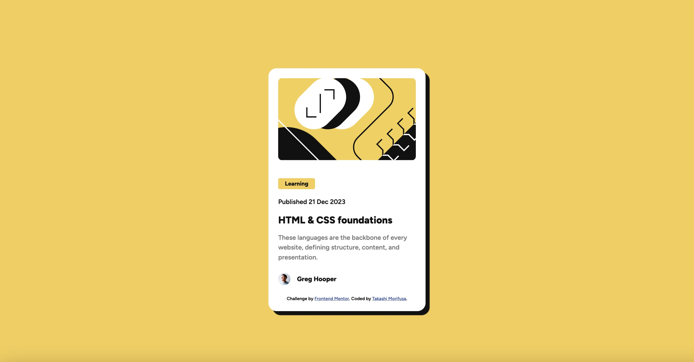
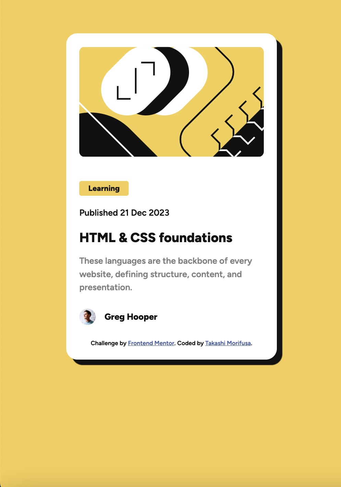

# Frontend Mentor - Blog preview card solution

This is a solution to the [Blog preview card challenge on Frontend Mentor](https://www.frontendmentor.io/challenges/blog-preview-card-ckPaj01IcS). Frontend Mentor challenges help you improve your coding skills by building realistic projects. 

## Table of contents

- [Overview](#overview)
  - [The challenge](#the-challenge)
  - [Screenshot](#screenshot)
  - [Links](#links)
- [My process](#my-process)
  - [Built with](#built-with)
  - [What I learned](#what-i-learned)
  - [Continued development](#continued-development)
  - [Useful resources](#useful-resources)
- [Author](#author)

**Note: Delete this note and update the table of contents based on what sections you keep.**

## Overview

### The challenge

Users should be able to:

- See hover and focus states for all interactive elements on the page

### Screenshot

### Links
- Solution URL: [Add solution URL here](https://your-solution-url.com)
- Live Site URL: [Add live site URL here](https://your-live-site-url.com)

## My process
Trance design images onto Figma to trace the side of components, radius, font size, padding to indentify CSS properties.

### Built with
- Semantic HTML5 markup
- CSS custom properties
- Flexbox

### What I learned
I learned how to align image and text side by side.
Also, I learned hover on CSS property.

### Useful resources
https://www.w3schools.com/
https://developer.mozilla.org/
https://stackoverflow.com/

## Author

- Website - [Takashi Morifusa](https://www.linkedin.com/in/morifusa/)
- Frontend Mentor - [@morifusa](https://www.frontendmentor.io/profile/morifusa)
- Twitter - [@omorifusa](https://www.twitter.com/morifusa)

# blog-preview-card
